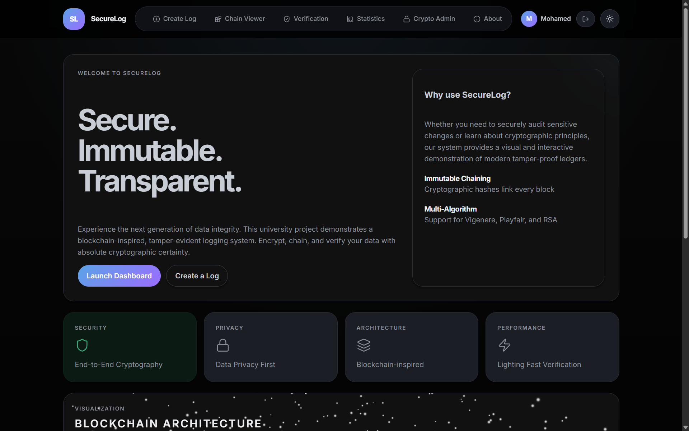
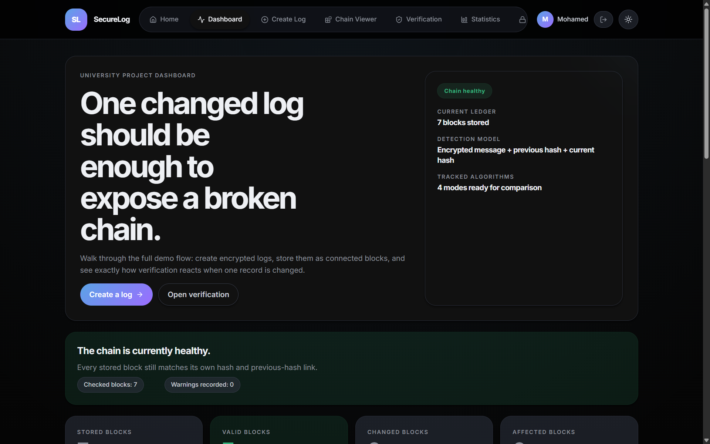
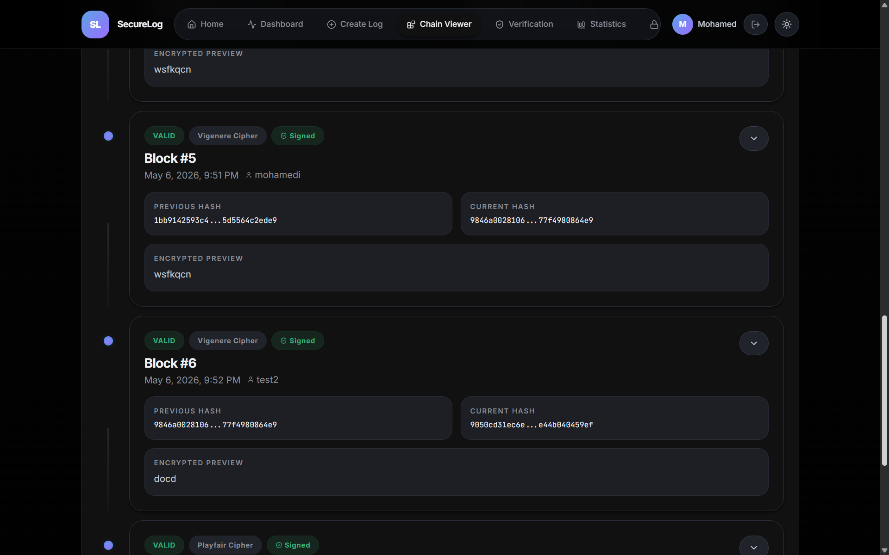
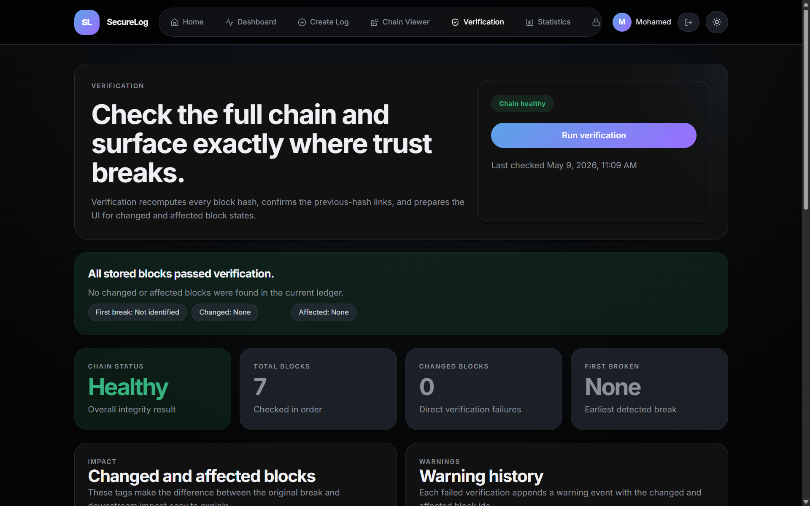
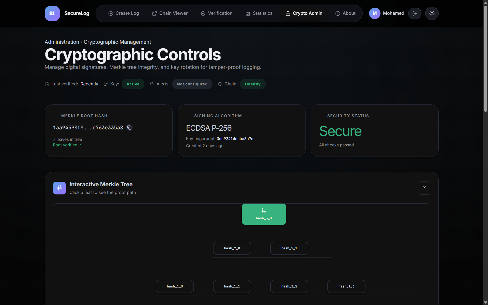

# 🔐 SecureLog — Blockchain-like Tamper-Proof Logging System

<div align="center">


[](https://fastapi.tiangolo.com/)
[](https://react.dev/)
[](https://python.org/)
[](https://vitejs.dev/)
[](LICENSE)

**A fullstack university demo that teaches tamper-evident logging through blockchain-inspired hash chaining, classical & modern cryptography, ECDSA digital signatures, and Merkle inclusion proofs.**

[🚀 Getting Started](#getting-started) · [📖 How It Works](#how-it-works) · [🔑 Features](#features) · [👥 Contributors](#contributors)

</div>

---

## 📸 Screenshots

<div align="center">

### 🏠 Landing Page
>


### 📊 Dashboard


### 🔗 Chain Viewer


### ✅ Verification


### 🔐 Crypto Admin

</div>

---

## 🗂 Project Structure

```text
blockchain-tamper-proof-logging-system/
├── backend/
│   ├── app/
│   │   ├── core/           # Config, rate limiter
│   │   ├── routers/        # FastAPI route handlers
│   │   ├── schemas/        # Pydantic models
│   │   └── services/       # Business logic, crypto, storage
│   ├── .env.example
│   ├── main.py
│   └── requirements.txt
├── frontend/
│   ├── src/
│   │   ├── components/     # React UI components
│   │   ├── lib/            # API client, auth, formatters
│   │   └── pages/          # Route-level page components
│   ├── .env.example
│   └── package.json
├── storage/
│   ├── keys/               # ECDSA signing key files (PEM)
│   ├── log_chain.jsonl     # Append-only block ledger
│   └── tamper_warnings.jsonl
├── playfair.py             # Playfair cipher implementation
├── vignere.py              # Vigenère cipher implementation
├── rsa.py                  # RSA implementation
├── hyprid.py               # Hybrid pipeline (Playfair → Vigenère → RSA)
└── enhancement.py          # Compatibility wrapper for hybrid module
```

---

## 💡 Core Idea

This is **not** a distributed blockchain. It is a **chained log demo** built for teaching:

| Concept | Description |
|---|---|
| 🔒 Block-level encryption | Each log is encrypted before storage |
| #️⃣ Deterministic hashing | SHA-256 over all block fields |
| 🔗 Previous-hash linking | Each block stores the prior block's hash |
| 🕵️ Tamper detection | Any field change is immediately detectable |
| 📡 Downstream impact | A single break invalidates the whole tail |
| ✍️ ECDSA signatures | P-256 digital signatures on every block |
| 🌲 Merkle proofs | Cryptographic inclusion proofs per block |

---

## 🔑 Features

- ✅ **Create encrypted log blocks** using Playfair, Vigenère, RSA, or Hybrid mode
- ✅ **File-backed JSONL ledger** — no database required for the chain
- ✅ **Interactive chain timeline** — one expanded card at a time for clean demos
- ✅ **Decrypt individual blocks** with optional key override
- ✅ **Verify the full chain** — classifies every block as `valid`, `tampered`, or `affected`
- ✅ **Tamper simulation** — break a block from the UI without recalculating its hash
- ✅ **Persistent warning events** appended to `tamper_warnings.jsonl`
- ✅ **ECDSA P-256 digital signatures** on every log block
- ✅ **Merkle tree** with interactive visualizer and inclusion proof generation
- ✅ **Key rotation** with automatic TTL enforcement and archive history
- ✅ **Real-time alerts** via configurable webhook and SMTP email
- ✅ **JWT authentication** for all protected API endpoints
- ✅ **Algorithm comparison** with benchmark timing charts
- ✅ **3D blockchain visualization** on the landing page (Three.js / React Three Fiber)
- ✅ **Dark / light theme** toggle with system preference detection

---

## 🔐 Cryptography

### Cipher Implementations (repo-local)

| File | Algorithm | Mode |
|---|---|---|
| `playfair.py` | Playfair Cipher | 5×5 key matrix, digraph substitution |
| `vignere.py` | Vigenère Cipher | Polyalphabetic substitution |
| `rsa.py` | RSA | Modular exponentiation with prime generation |
| `hyprid.py` | Hybrid Pipeline | Playfair → Vigenère → RSA |
| `enhancement.py` | Compatibility Wrapper | Delegates to `hyprid.py` |

All modules are loaded at runtime via `backend/app/services/legacy_crypto_loader.py` and validated on startup by `crypto_self_check.py`.

### Hash Chaining

For each block, the backend computes:

```
current_hash = SHA-256(
    encrypted_message +
    algorithm +
    key_metadata +
    previous_hash +
    created_at +
    hybrid_steps
)
```

Because the input is fully deterministic, **any** change to ciphertext, metadata, timestamps, or chain links produces a completely different hash during verification.

### Digital Signatures (ECDSA P-256)

Every block is signed using an ECDSA P-256 private key:

```
signature = ECDSA-P256-SHA256(
    id + encrypted_message + algorithm +
    previous_hash + current_hash + created_at
)
```

### Merkle Tree

All block hashes form a Merkle tree whose root hash represents the entire ledger. A Merkle proof verifies any single block's inclusion in O(log n) without revealing other entries.

---

## 🏗 How Hash Chaining Works

```
Genesis Block
┌─────────────────────────────┐
│ previous_hash: GENESIS::... │
│ encrypted_message: ...      │
│ current_hash: SHA-256(...)  │
└────────────┬────────────────┘
             │ current_hash becomes next previous_hash
             ▼
Block #2
┌─────────────────────────────┐
│ previous_hash: <block1 hash>│
│ encrypted_message: ...      │
│ current_hash: SHA-256(...)  │
└────────────┬────────────────┘
             │
             ▼
Block #3  ← tamper here →  Block #4 (affected), Block #5 (affected), ...
```

---

## 🖥 Backend Stack

| Technology | Purpose |
|---|---|
| **FastAPI** | REST API framework |
| **Uvicorn (ASGI)** | Production-grade async server |
| **Pydantic v2** | Schema validation and serialization |
| **python-jose** | JWT token generation and verification |
| **cryptography** | ECDSA P-256 key generation and signing |
| **SQLite + sqlite3** | User auth, audit trail, key metadata |
| **JSONL files** | Append-only block ledger and warning history |
| **slowapi** | Rate limiting |

### Main API Endpoints

```
POST   /api/auth/register          Register a new user
POST   /api/auth/login             Authenticate and receive JWT
GET    /api/auth/me                Get current user info

POST   /api/logs                   Create a new encrypted log block
GET    /api/logs                   List all blocks
GET    /api/logs/{id}              Get a specific block
POST   /api/logs/{id}/decrypt      Decrypt a block
POST   /api/logs/{id}/tamper       Simulate tampering on a block

POST   /api/chain/verify           Verify the full chain
GET    /api/chain/warnings         List warning history
POST   /api/chain/reset            Clear ledger and warnings

GET    /api/comparison/metrics     Algorithm benchmark metrics

GET    /api/crypto/signatures/key-info     Current signing key info
POST   /api/crypto/signatures/generate-key Generate ECDSA key
POST   /api/crypto/signatures/verify/{id}  Verify block signature
GET    /api/crypto/merkle/tree             Merkle tree info
GET    /api/crypto/merkle/proof/{id}       Inclusion proof for a block
POST   /api/crypto/merkle/verify           Verify a Merkle proof
GET    /api/crypto/keys/status             Key rotation status
POST   /api/crypto/keys/rotate             Manual key rotation
GET    /api/crypto/keys/health             Key health check

POST   /api/alerts/test/email      Send test email alert
POST   /api/alerts/test/webhook    Send test webhook alert
GET    /api/alerts/config          Current alert configuration
GET    /api/alerts/status          Alert service status
```

---

## 🎨 Frontend Stack

| Technology | Purpose |
|---|---|
| **React 18** | UI framework |
| **Vite 6** | Build tool and dev server |
| **TanStack Query** | Server state management and caching |
| **Axios** | HTTP client with JWT interceptors |
| **Framer Motion** | Animations and page transitions |
| **Recharts** | Algorithm comparison bar charts |
| **React Three Fiber** | 3D blockchain visualization |
| **@react-three/drei** | Three.js helpers (Stars, Float, Line) |
| **React Router v6** | Client-side routing with protected routes |
| **Lucide React** | Icon library |

---

## 🚀 Getting Started

### Prerequisites

- Python 3.11+
- Node.js 18+

### 1. Backend

```bash
cd backend
python -m venv .venv

# Windows
.venv\Scripts\activate

# macOS / Linux
source .venv/bin/activate

pip install -r requirements.txt
copy .env.example .env   # Windows
# cp .env.example .env   # macOS / Linux

uvicorn app.main:app --reload
```

The API starts on **http://localhost:8000**. Interactive docs at **http://localhost:8000/docs**.

### 2. Frontend

```bash
cd frontend
npm install
copy .env.example .env   # Windows
# cp .env.example .env   # macOS / Linux

npm run dev
```

The frontend starts on **http://localhost:5173**.

---

## ⚙️ Environment Variables

### Backend (`backend/.env`)

| Variable | Default | Description |
|---|---|---|
| `APP_NAME` | `Blockchain-like Tamper-Proof...` | Application name |
| `API_PREFIX` | `/api` | API route prefix |
| `FRONTEND_ORIGIN` | `http://localhost:5173` | CORS allowed origin |
| `CRYPTO_SOURCE_DIR` | *(project root)* | Path to cipher `.py` files |
| `STORAGE_DIR` | *(project root)/storage* | Path to JSONL storage |
| `LOG_CHAIN_FILE` | `log_chain.jsonl` | Ledger filename |
| `TAMPER_WARNING_FILE` | `tamper_warnings.jsonl` | Warning ledger filename |
| `SEED_DEMO_DATA` | `true` | Seed 4 demo blocks on startup |
| `SECRET_KEY` | *(auto-generated)* | JWT signing secret — **change in production** |
| `JWT_EXPIRE_MINUTES` | `1440` | Token lifetime (24 hours) |
| `KEY_TTL_DAYS` | `90` | ECDSA key rotation TTL |
| `ALERT_WEBHOOK_URL` | *(empty)* | Slack / webhook URL |
| `ALERT_EMAIL_TO` | *(empty)* | Alert recipient email |
| `SMTP_HOST` | *(empty)* | SMTP server hostname |
| `SMTP_PORT` | `587` | SMTP port |
| `SMTP_USER` | *(empty)* | SMTP username |
| `SMTP_PASSWORD` | *(empty)* | SMTP password / app password |

### Frontend (`frontend/.env`)

| Variable | Default | Description |
|---|---|---|
| `VITE_API_BASE_URL` | `http://localhost:8000/api` | Backend API base URL |

---

## 🎮 Demo Flow

### 1 · Create a Block

1. Open **Create Log**
2. Enter any log message (or upload a `.txt` file)
3. Choose Playfair, Vigenère, RSA, or Hybrid
4. Provide a key for Playfair or Vigenère
5. Submit → a new linked block appears in the chain

### 2 · Test Tampering

1. Open **Chain Viewer** → expand any block
2. Click **Tamper this block**
3. Open **Verification**
4. The UI shows the changed block, the first broken link, and all downstream affected blocks
5. A warning is appended to `storage/tamper_warnings.jsonl`

### 3 · Manual File Edit Test

1. Open `storage/log_chain.jsonl` in any text editor
2. Modify a field in any block (e.g. change one character in `encrypted_message`)
3. Reload the app or click **Run Verification**
4. The backend detects the mismatch and records a warning event

### 4 · Decrypt a Block

1. Open **Chain Viewer** → expand any block
2. Click **Reveal decrypted message**
3. For Playfair / Vigenère, you can override the key for a quick demo
4. RSA and Hybrid use their repo-local implementations automatically

### 5 · Verify a Merkle Proof

1. Open **Crypto Admin → Merkle Tree**
2. Click any leaf node in the interactive tree
3. The proof path lights up — siblings highlighted in amber, proof path in blue
4. Click **Verify Proof** to confirm inclusion against the root hash

---

## 🔍 Verification Behaviour

| Status | Meaning |
|---|---|
| ✅ `valid` | Block matches its stored hash and previous-hash link |
| ❌ `tampered` | Block's own hash or previous-hash field was directly changed |
| ⚠️ `affected` | Block is unchanged but an earlier break invalidates its chain link |

---

## 📚 Educational Clarification

> This is a **blockchain-inspired integrity demo**, not a cryptocurrency blockchain.

There is no mining, no peer-to-peer replication, no consensus protocol, no wallets, and no smart contracts. The goal is to explain **how encryption plus chained hashes make log tampering visible** in a clean, interactive, demo-friendly environment.

---

## 👥 Contributors

<table>
  <tr>
    <td align="center" width="200">
      <strong>Mohamed Elhadad</strong><br/>
      <sub>
       🎨 Playfair Cipher<br/>
        ⚛️ Frontend &amp; Backend &amp; Deployment 
      </sub>
    </td>
    <td align="center" width="200">
      <strong>Malak Ahmed</strong><br/>
      <sub>
        🔐 RSA Implementation
      </sub>
    </td>
    <td align="center" width="200">
      <strong>Menna Eldemerdash</strong><br/>
      <sub>
        🔐 RSA Implementation
      </sub>
    </td>
  </tr>
  <tr>
    <td align="center" width="200">
      <strong>Mohamed Elfeky</strong><br/>
      <sub>
        📋 Log Design<br/>
        🏗️ Core System — hashing, chaining, storage
      </sub>
    </td>
    <td align="center" width="200">
      <strong>Omar Abdelhamed</strong><br/>
      <sub>
        🎨 Playfair Cipher<br/>
        ⚛️ Frontend &amp; Backend
      </sub>
    </td>
    <td align="center" width="200">
      <strong>Zeyad Ashraf</strong><br/>
      <sub>
        🔤 Vigenère Cipher
      </sub>
    </td>
  </tr>
</table>

---

## 📁 Related Files

| File | Purpose |
|---|---|
| `DESIGN.md` | Frontend design direction and visual language |
| `IMPLEMENTATION_PLAN.md` | Sprint-based execution plan for the refactor |
| `backend/app/services/crypto_self_check.py` | Validates all cipher implementations on startup |
| `storage/log_chain.jsonl` | Live block ledger (edit to test manual tampering) |
| `storage/tamper_warnings.jsonl` | Persistent warning history (survives restarts) |

---

<div align="center">

**SecureLog** — Blockchain-Powered Tamper-Proof Logging &middot; University Project

*Built with ❤️ using React, FastAPI, ECDSA, and SHA-256*

</div>